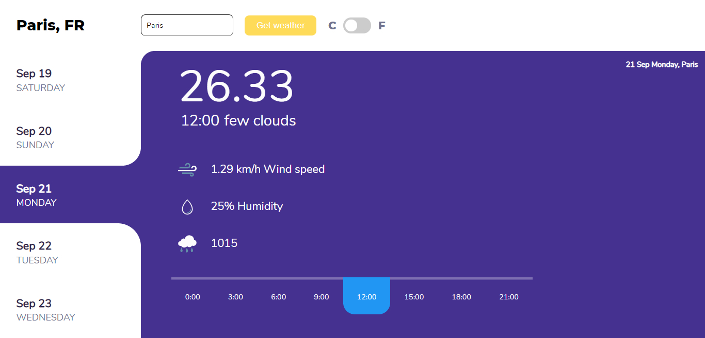

# Weather app - A Microverse educational project

Building a weather app page using JavaScript, Webpack, and OpenWeather API. Learning how to work with API, fetch data, async, await features, modules and webpack.

## Screenshots

## Built With

-   HTML5
-   CSS3
-   Javascript
-   Webpack
-   Google Fonts
-   OpenWeatherApi

## Live Demo

[Demo]()

## Getting Started

- Fork the repository and create a local one on your computer;
- Move to the repository inside the command line using `cd` and the path to the file;
- open `index.html` file on your browser.

## Authors

👤 Nurislam Ab
- Github: [@nurislam-ab](https://github.com/nurislam-ab)
- Twitter: [@NurislamAb](https://twitter.com/NurislamAb)
- Linkedin: [nurislam-ab](https://www.linkedin.com/in/nurislam-ab/)

## 🤝 Contributing

Contributions, issues, and feature requests are welcome!

Feel free to check the [issues page](issues/).

## Acknowledgments

* Design idea inspired by the [Vishnu Prasad](https://dribbble.com/shots/10879558-App-concept-to-know-Weather)
* OpenWeather API

## Show your support

Give a ⭐️ if you like this project!

## 📝 License

This project is [MIT](LICENSE) licensed.